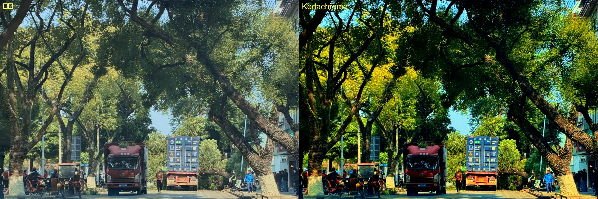
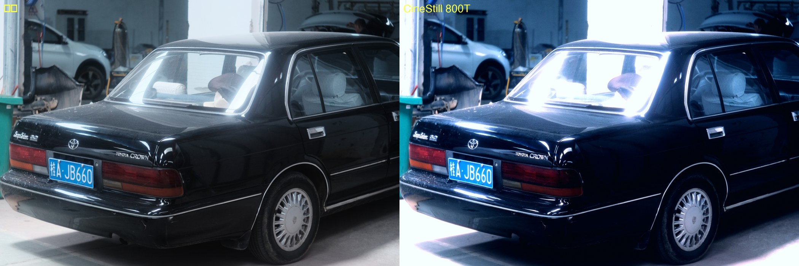
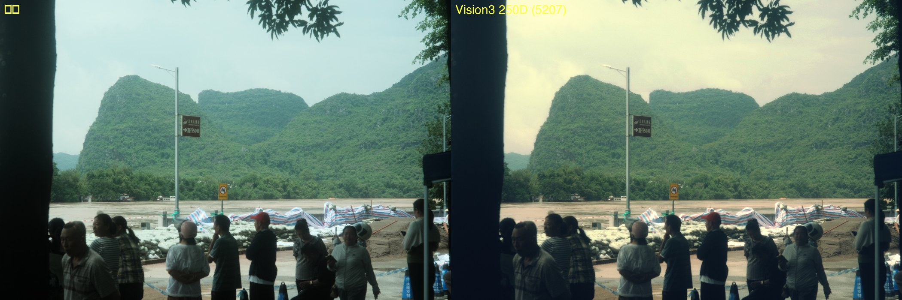
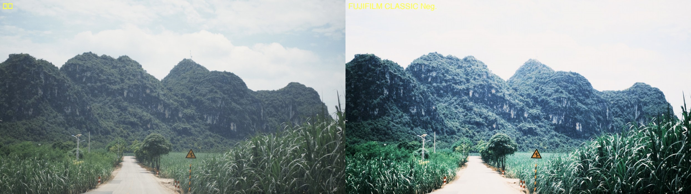

# 修图 — 纯代码调色工具链

用 Python (NumPy/OpenCV) 实现 Lightroom/DaVinci 风格的照片调色，支持 AI Agent 自动调色。

## 效果图

每组左为原图、右为调色结果（均为本工具单次处理直出，无后期）。

**柯达 Kodachrome 风格**（`--set film_stock=kodachrome`）



**CineStill 800T 风格**（`--set film_stock=800t`，冷调 + 红色光晕）



**柯达 Vision3 250D (5207) 电影负片风格**（`--set film_stock=5207`）



**FUJIFILM CLASSIC Neg.**（富士官方 F-Log2 LUT，需自行下载 `.cube` 放入 `luts/`）



## 快速开始

```bash
# 分析照片
python3 retouch.py analyze 图片1.JPG

# 自然语言调色（自动生成对比图 *_compare.jpg）
python3 retouch.py grade 图片1.JPG output/out.jpg --style "电影感 更冷一点"

# 自动分析 + 迭代调色
python3 retouch.py auto 图片1.JPG output/auto.jpg --style "日系"

# 预设
python3 retouch.py presets
python3 retouch.py grade in.jpg out.jpg --preset cinematic

# 批量
python3 retouch.py batch input/ output/ --preset warm_film -r

# 直接设参数
python3 retouch.py grade in.jpg out.jpg --set exposure=0.5 --set temp=0.2 --set film_stock=portra400

# .cube LUT
python3 retouch.py grade in.jpg out.jpg --lut path/to/lut.cube --lut-strength 0.8
```

完整参数表和 Agent 工作流见 [AGENTS.md](AGENTS.md)。

## 模块

`core/` 下每个模块独立可用（均接受/返回 float32 RGB [0,1]）：
`basic_grade`（曝光/对比/高光阴影/饱和度）、`color_grade`（色温/HSL/曲线/色彩矩阵/分离色调）、
`curves`（单调样条曲线引擎）、`lut`（.cube 3D LUT 三线性插值）、`film`（胶片曲线/颗粒/光晕/褪色）、
`analyze`（自动分析与建议）、`pipeline`（预设/自然语言/批量/自动迭代）。

## 性能

全管线（含胶片颗粒+暗角）处理 2688×4032 约 1.7s（M1, NumPy 向量化 + LUT 查表）。
瓶颈在胶片颗粒等像素级操作；如需更快可减小 `grain_size` 或对预览降采样。
